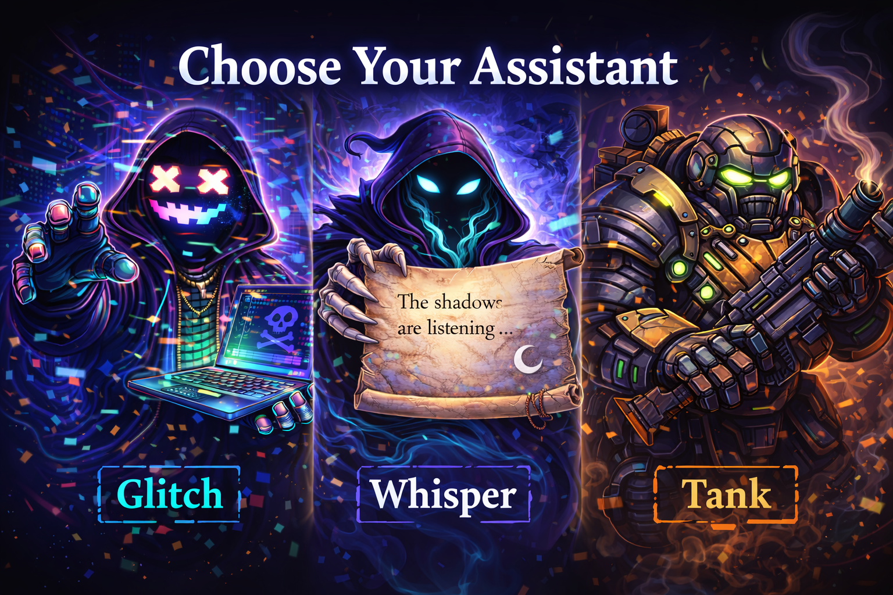
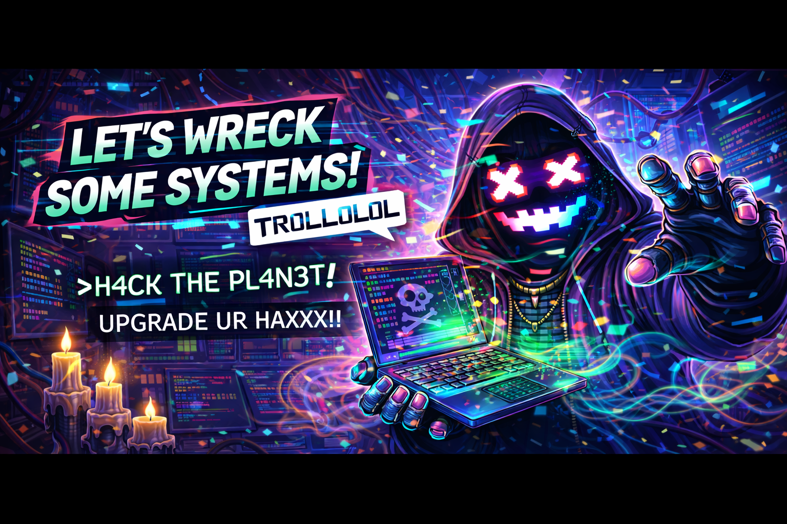
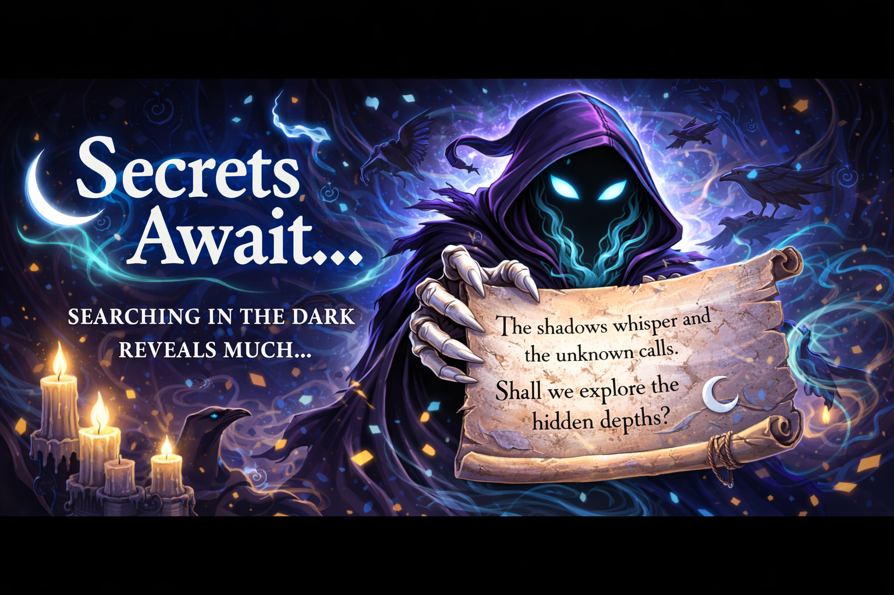
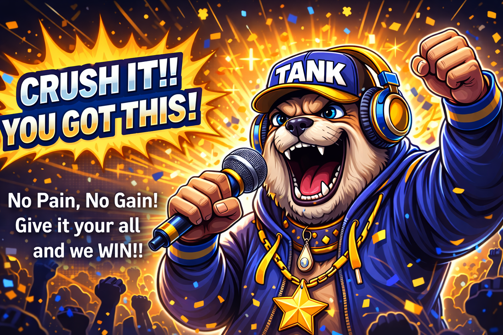

# Discord Arcade

A multi-game Discord bot platform built with C# and Discord.Net. The first game is **Heist Tower**: A progressive word-scramble PvP game where players climb a 5-level tower by solving increasingly difficult word scrambles, using power cards strategically, and sabotaging opponents. First to clear the Crown Room wins.

## How It Works

An admin initializes a persistent tower of Discord categories, channels, and per-room roles. Each level has 3 rooms, each with its own scrambled word puzzle. Players must solve all 3 rooms in a level before advancing to the next. Players type their answers directly in the channel. Correct answers advance you to the next room (or next level after room 3). Wrong answers drop you down 1-2 levels and reset you to room 1. Player visibility is controlled by role assignments, so the tower persists across games and bot restarts.

### Tower Structure

Each level has 3 rooms (configurable via `RoomsPerLevel`). Rooms are named `room-1a-basement`, `room-1b-basement`, `room-1c-basement`, etc.

| Level | Name | Difficulty |
|-------|------|------------|
| 1 | Basement | 4-5 letter words |
| 2 | Ground Floor | 6-7 letter words |
| 3 | Vault Corridor | 8-9 letter words |
| 4 | Security Room | Themed heist words |
| 5 | Crown Room | Double-word scrambles |

### Risk Mechanic

- **Wrong guess**: Drop 1 level (reset to room 1) + 10 second cooldown
- **Two wrong in a row**: Drop 2 levels (reset to room 1) + cooldown
- Penalties are at level granularity — you lose all room progress in the target level
- This prevents brute-force guessing

### Power Cards

Every 3 rooms cleared, you earn a random card:

| Card | Effect |
|------|--------|
| Knockback | Push a player down 1 level (resets to room 1) |
| Shield | Block the next knockback against you |
| Spy | Reveal one letter of your current room's puzzle |
| Freeze | Freeze a player for 60 seconds |
| Chaos | Re-scramble another player's current room's puzzle |
| Hint | Get a letter-based clue for your current room's puzzle |

### AI Assistants

Players can choose an AI assistant companion that provides in-character commentary during the game. Powered by Ollama for local LLM inference.

<p align="center">
  
</p>

| Assistant | Banner | Personality |
|-----------|--------|------------|
| Glitch |  | Chaotic hacker AI — sarcastic, punchy, loves exploits |
| Whisper |  | Mysterious phantom — cryptic, speaks in riddles |
| Tank |  | Hype coach — loud, motivational, fiercely loyal |

Each assistant has multiple banner images that are randomly selected per response, giving variety to the in-game experience.

## Prerequisites

- [.NET 9 SDK](https://dotnet.microsoft.com/download/dotnet/9.0)
- [Ollama](https://ollama.ai) (optional, for AI assistants)
- A Discord bot application with the following:
  - **Bot token** from the [Discord Developer Portal](https://discord.com/developers/applications)
  - **Privileged Gateway Intents** enabled: `Server Members Intent` and `Message Content Intent`
  - Bot invited to your server with these permissions: `Manage Channels`, `Manage Roles`, `Send Messages`, `Embed Links`, `Use Slash Commands`

### Bot Invite URL

When inviting the bot, use the OAuth2 URL generator in the Developer Portal with these scopes and permissions:

- **Scopes:** `bot`, `applications.commands`
- **Bot Permissions:** `Manage Channels`, `Manage Roles`, `Send Messages`, `Embed Links`

## Configuration

### Bot Token

Set the token via environment variable (recommended):

```bash
# Windows Command Prompt
set HEIST_BOT_TOKEN=your-bot-token-here

# Windows PowerShell
$env:HEIST_BOT_TOKEN = "your-bot-token-here"

# Linux / macOS
export HEIST_BOT_TOKEN=your-bot-token-here
```

Or place it in `Arcade.Heist/appsettings.json`:

```json
{
  "Bot": {
    "BotToken": "your-bot-token-here"
  }
}
```

### Guild ID (Optional)

Setting a Guild ID registers slash commands instantly to that server (recommended during development). Without it, commands register globally which can take up to an hour to propagate.

```json
{
  "Bot": {
    "GuildId": 123456789012345678
  }
}
```

### All Settings

Configuration is split across three sections in `appsettings.json`:

**Bot** (shared):

| Setting | Default | Description |
|---------|---------|-------------|
| `BotToken` | `""` | Discord bot token |
| `GuildId` | `0` | Target guild (0 = register commands globally) |

**AI** (shared):

| Setting | Default | Description |
|---------|---------|-------------|
| `AssistantEnabled` | `true` | Enable/disable AI assistants |
| `OllamaEndpoint` | `"http://localhost:11434"` | Ollama API endpoint |
| `OllamaDefaultModel` | `"llama3.2"` | Default LLM model |
| `AssistantsConfigPath` | `"assistants.json"` | Path to assistant profiles |
| `PlayerDataPath` | `"data/players.json"` | Path to player preferences data |
| `AssistantMaxTokens` | `150` | Max tokens per AI response |
| `AssistantTimeoutSeconds` | `30` | Timeout for Ollama requests |

**Heist** (game-specific):

| Setting | Default | Description |
|---------|---------|-------------|
| `LobbyCountdownSeconds` | `10` | Seconds to wait in lobby before game starts |
| `WrongGuessCooldownSeconds` | `10` | Cooldown after a wrong guess |
| `FreezeDurationSeconds` | `60` | Duration of the Freeze card effect |
| `CrownHoldSeconds` | `60` | Seconds to hold Crown Room in King of the Tower mode |
| `CardAwardInterval` | `3` | Rooms cleared between card awards |
| `RoomsPerLevel` | `3` | Number of rooms per tower level |
| `MaxLevels` | `5` | Number of tower levels |
| `TowerDataPath` | `"data/tower.json"` | File path for persisted tower data |

## Build & Run

```bash
# Build
dotnet build Arcade.sln

# Run
dotnet run --project Arcade.Heist

# Build release
dotnet build Arcade.sln -c Release
```

The bot will log in and appear online in your Discord server. If a Guild ID is configured, slash commands will be available immediately.

## Playing the Game

### Commands

| Command | Description |
|---------|-------------|
| `/ping` | Check if the bot is alive |
| `/heist-help` | Show how-to-play instructions |
| `/heist-init` | Initialize the tower — creates roles, categories, and channels (admin only) |
| `/heist-teardown` | Tear down the tower — deletes all tower roles, categories, and channels (admin only) |
| `/heist-start` | Create a lobby and start a heist after countdown (requires initialized tower) |
| `/heist-join` | Join the current lobby |
| `/heist-leave` | Leave the lobby |
| `/heist-status` | See who's on which level |
| `/heist-cards` | View your power card inventory |
| `/use-card <card> [target]` | Use a power card (some require a target player) |
| `/heist-end` | Force-end the heist and strip player roles (admin only) |
| `/choose-assistant` | Choose an AI assistant companion |
| `/ask-assistant <question>` | Ask your assistant a question |

### Gameplay Flow

1. An admin runs `/heist-init` once to create the persistent tower (roles, categories, channels — 3 rooms per level)
2. A player runs `/heist-start` — this creates a lobby
3. Other players join with `/heist-join`
4. After the countdown, players receive their Level 1 Room 1 role and can see only that room's channel
5. A scrambled word appears in your room's channel — type the unscrambled answer
6. Correct answer = advance to the next room (or next level after room 3). Wrong answer = drop 1-2 levels to room 1 + cooldown
7. Every 3 rooms cleared, you get a random power card to use against others
8. First player to clear all 3 rooms of Level 5 (Crown Room) wins
9. Game end strips all heist roles — the tower stays intact for the next game

### Tips

- Don't guess randomly — two wrong answers in a row drops you 2 levels and resets you to room 1
- Save Knockback cards for when opponents are near the top
- Shield is best used preemptively when you're deep into Level 4-5
- Freeze can lock someone out for a full minute — use it at a critical moment
- You can check the game state anytime with `/heist-status`
- Choose an AI assistant with `/choose-assistant` for in-game commentary

## Project Structure

```
Arcade.sln
├── Arcade.Core/                            Shared infrastructure (class library)
│   ├── Configuration/
│   │   ├── BotOptions.cs                   Bot token & guild settings
│   │   └── AiOptions.cs                    AI/Ollama settings
│   ├── Models/
│   │   ├── AssistantProfile.cs             AI assistant profile model
│   │   └── PlayerPreferences.cs            Player preference model
│   ├── AI/
│   │   ├── OllamaService.cs               Ollama HTTP client
│   │   ├── AssistantService.cs             AI assistant orchestrator
│   │   └── IAssistantEventHandler.cs       Interface for posting AI commentary
│   ├── Data/
│   │   └── PlayerDataStore.cs              Player preferences persistence
│   └── Discord/
│       └── BotHostedServiceBase.cs         Abstract bot lifecycle base class
│
└── Arcade.Heist/                           Heist Tower game (console app)
    ├── Program.cs                          Host setup & dependency injection
    ├── appsettings.json                    Configuration
    ├── assistants.json                     AI assistant profiles
    ├── Assets/
    │   └── Images/
    │       ├── Dialogs/                    Dialog banner images (e.g. assistant selection)
    │       ├── Glitch/                     Glitch assistant banners
    │       ├── Whisper/                    Whisper assistant banners
    │       └── Tank/                       Tank assistant banners
    ├── Configuration/
    │   └── HeistOptions.cs                 Game-specific settings
    ├── AI/
    │   ├── HeistAssistantEventHandler.cs   Posts AI commentary as Discord embeds
    │   └── HeistGameContext.cs             Formats player state for AI context
    ├── Data/
    │   └── TowerDataStore.cs               Persistent tower data
    ├── Discord/
    │   ├── HeistBotHostedService.cs        Bot lifecycle (extends base)
    │   ├── Commands/
    │   │   └── HeistCommands.cs            Slash command handlers
    │   ├── Handlers/
    │   │   └── MessageHandler.cs           In-channel answer listener
    │   └── Embeds/
    │       └── GameEmbeds.cs               Rich embed builders
    └── Game/
        ├── Models/
        │   ├── GameState.cs                Game status & data
        │   ├── PlayerState.cs              Per-player tracking
        │   ├── Puzzle.cs                   Puzzle data
        │   ├── PowerCard.cs                Card type enum
        │   ├── LevelInfo.cs                Level metadata
        │   └── RoomInfo.cs                 Room metadata (channel & role IDs)
        ├── Words/
        │   ├── WordBank.cs                 Word lists (5 tiers)
        │   └── WordScrambler.cs            Scramble logic
        └── Engine/
            ├── GameManager.cs              Central game orchestrator
            ├── TowerManager.cs             Tower init, teardown & player movement
            ├── PlayerManager.cs            Player state transitions
            ├── PuzzleManager.cs            Puzzle generation & validation
            └── CardManager.cs              Power card effects
```

## Tech Stack

- **.NET 9** (C#)
- **Discord.Net** — Discord API wrapper
- **Microsoft.Extensions.Hosting** — Generic host, DI, configuration
- **Ollama** — Local LLM inference for AI assistants
